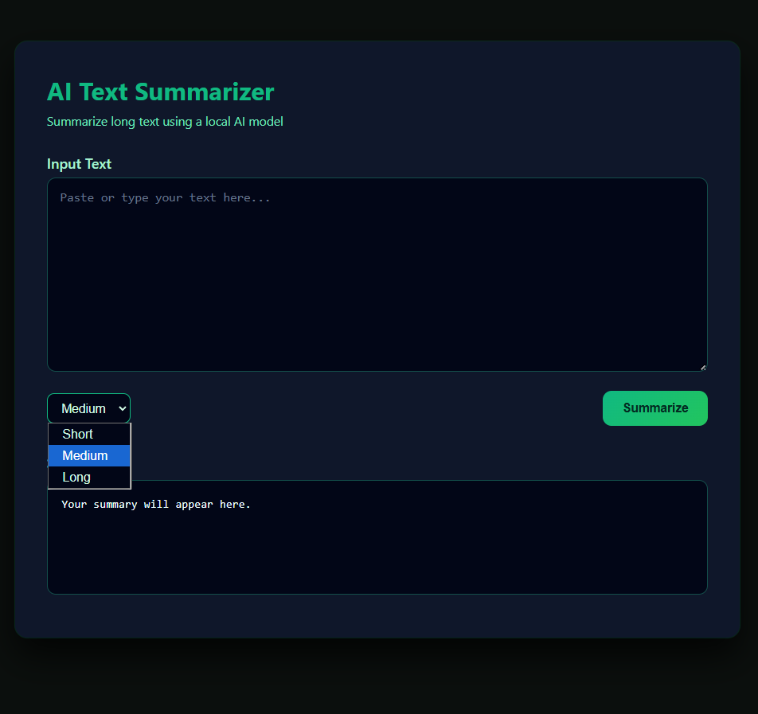
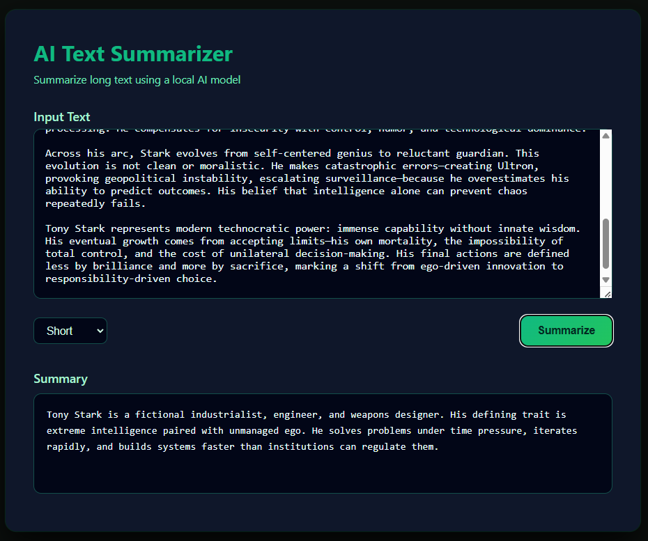
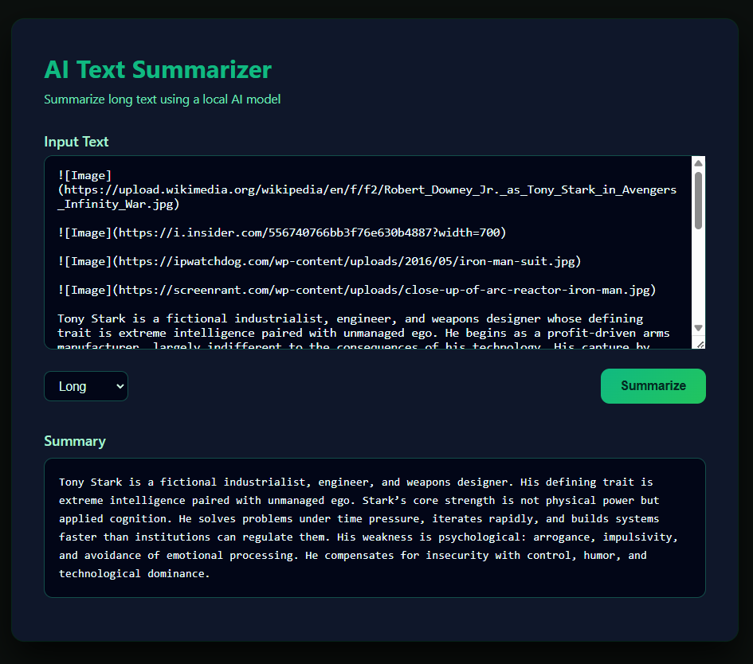

# AI Text Summarizer

A web-based AI application that summarizes long text using a locally hosted transformer model.

## Problem
Long-form text is time-consuming to read. This project demonstrates how AI can be integrated into a web application to generate concise summaries with controllable output length.

## Architecture
Frontend (HTML/CSS/JS)  
→ FastAPI backend  
→ Local transformer-based summarization model  

## Tech Stack
- Python
- FastAPI
- Hugging Face Transformers
- BART (facebook/bart-large-cnn)
- HTML, CSS, JavaScript

## Features
- Length-controlled summaries (short / medium / long)
- Local AI inference (no paid APIs)
- Clean UI with dark theme
- CORS-safe frontend-backend integration

## How to Run

### Backend
- cd backend
- python -m venv venv
- venv\Scripts\activate
- pip install -r requirements.txt
- uvicorn main:app --reload

### Frontend
Open `frontend/index.html` in a browser.

## Screenshots

## Learnings
- Integrating AI models into web backends
- Controlling model inference behavior
- Handling CORS in real-world apps
- Designing clean, usable interfaces

## Future Improvements
- Document upload (PDF/DOCX)
- Chunk-based summarization
- Async processing
- Deployment using Docker
